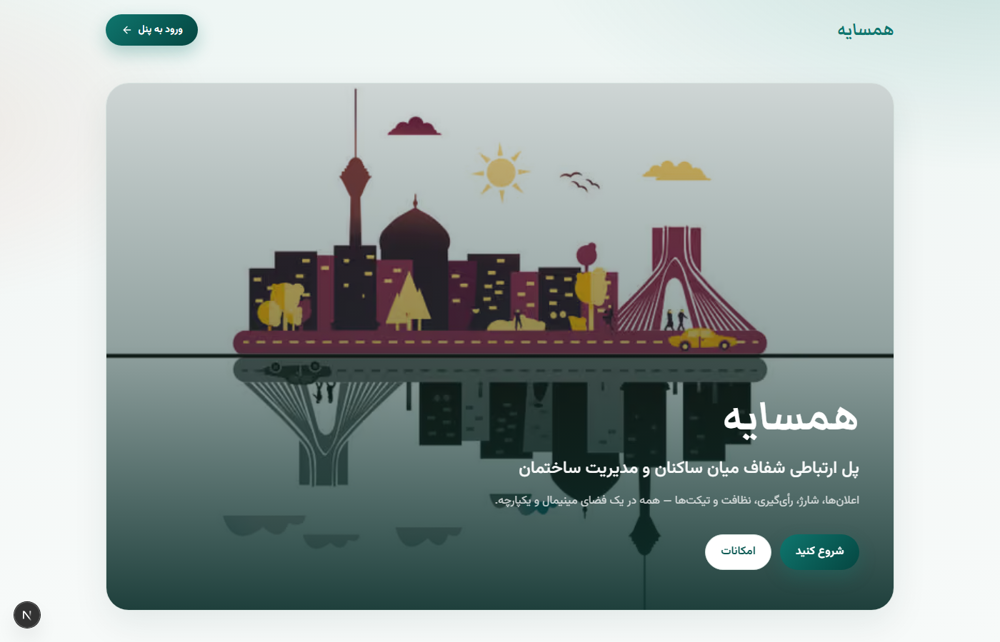
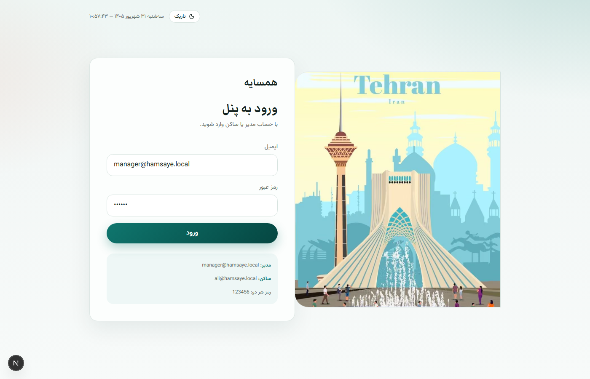
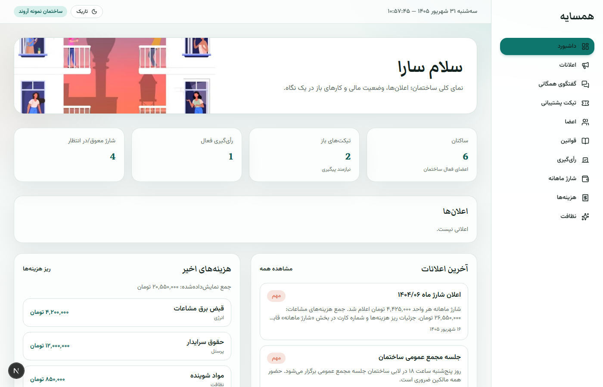
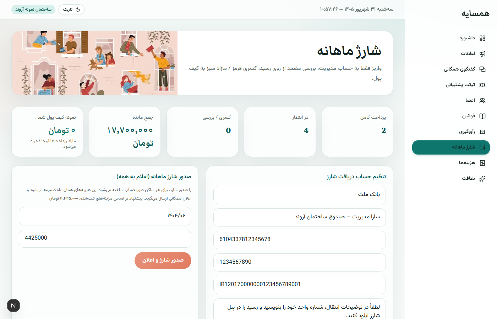
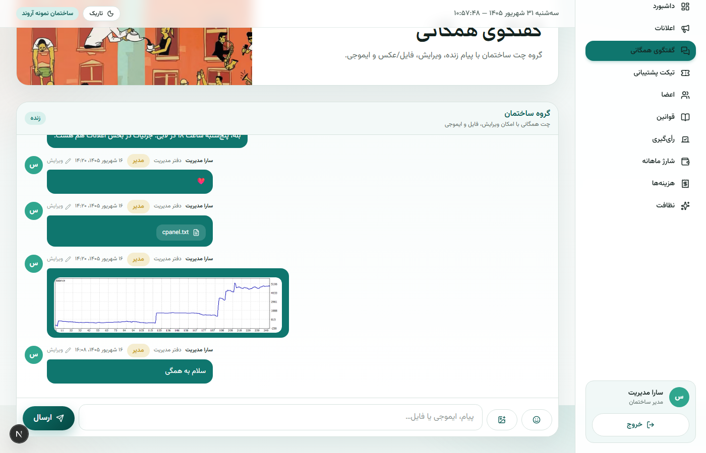
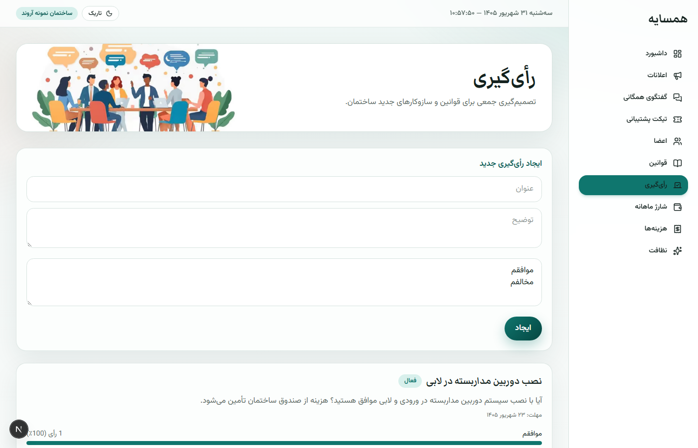

# همسایه (Hamsaye) — سیستم مدیریت ساختمان مسکونی

<p align="center">
  
</p>

**همسایه** یک پلتفرم یکپارچه برای مدیریت ساختمان‌های مسکونی است: ارتباط شفاف بین ساکنان و مدیریت، شارژ ماهانه با رسید کارت‌به‌کارت، رأی‌گیری، تیکت پشتیبانی، و گفتگوی همگانی زنده.

---

## ویژگی‌ها

| ماژول | توضیح |
|--------|--------|
| **داشبورد** | نمای کلی اعلان‌ها، تیکت‌ها، شارژ و اعلان‌های سیستمی |
| **اعلانات** | ارسال اعلان همگانی توسط مدیریت (جلسات، قطعی‌ها، اخبار مهم) |
| **گفتگوی همگانی** | چت گروهی زنده (SSE) با ویرایش، ایموجی، و ارسال عکس/فایل |
| **تیکت پشتیبانی** | درخواست رسمی ساکن ↔ مدیریت با وضعیت و پاسخ |
| **اعضا** | فهرست ساکنان و نقش‌ها |
| **قوانین** | آیین‌نامه ساختمان |
| **رأی‌گیری** | ایجاد نظرسنجی و رأی اعضا با نمودار نتیجه |
| **شارژ ماهانه** | صدور شارژ، شماره کارت مدیریت، آپلود رسید، OCR مبلغ، بررسی مقصد واریز، کیف پول برای مازاد |
| **هزینه‌ها** | ریز هزینه‌های مشاعات |
| **نظافت** | برنامه هفتگی نظافت مشاعات |
| **تم تاریک/روشن** | ذخیره در مرورگر |
| **ساعت شمسی** | تاریخ و ساعت جلالی زنده در هدر |

### جریان پرداخت شارژ

1. مدیریت شماره کارت/حساب را تنظیم و شارژ ماه را صادر می‌کند  
2. ساکن مبلغ را کارت‌به‌کارت واریز می‌کند  
3. عکس رسید را آپلود می‌کند؛ مبلغ با OCR خوانده می‌شود  
4. مقصد واریز با حساب مدیریت تطبیق داده می‌شود  
5. سر به سر → پرداخت کامل · کمتر → کسری (قرمز) · بیشتر → مازاد به کیف پول (سبز)

---

## اسکرین‌شات‌ها

### لندینگ


### ورود


### داشبورد


### شارژ ماهانه


### گفتگوی همگانی


### رأی‌گیری


---

## استک فنی

- **Next.js** (App Router) + TypeScript + Tailwind CSS  
- **Prisma** + SQLite  
- احراز هویت مبتنی بر کوکی امضاشده (نقش مدیر / ساکن)  
- OCR رسید با Tesseract.js (کلاینت)  
- چت زنده با Server-Sent Events  

---

## اجرا

```bash
npm install
npm run db:push
npm run db:seed
npm run dev
```

باز کنید: [http://localhost:3000](http://localhost:3000)

### حساب‌های آزمایشی

| نقش | ایمیل | رمز |
|------|--------|------|
| مدیر | `manager@hamsaye.local` | `123456` |
| ساکن | `ali@hamsaye.local` | `123456` |

> فایل `.env` را کپی/تنظیم کنید (`DATABASE_URL`, `SESSION_SECRET`). دیتابیس SQLite محلی است و در گیت نیست.

---

## ساختار

```
src/app/(app)/     # صفحات پنل (داشبورد، شارژ، چت، …)
src/app/api/       # API routes
src/components/    # UI مشترک، تم، ساعت شمسی
src/lib/           # auth, prisma, OCR, wallet
prisma/            # schema + seed
public/illustrations/  # تصاویر وکتور برند
```

---

## مجوز

پروژه نمونه آموزشی/دمو. برای استفاده عملی، امنیت پرداخت و احراز هویت را مطابق نیاز خود سخت‌تر کنید.

---

<p align="center">
  ساخته‌شده برای مدیریت بهتر زندگی در ساختمان — <b>همسایه</b>
</p>
